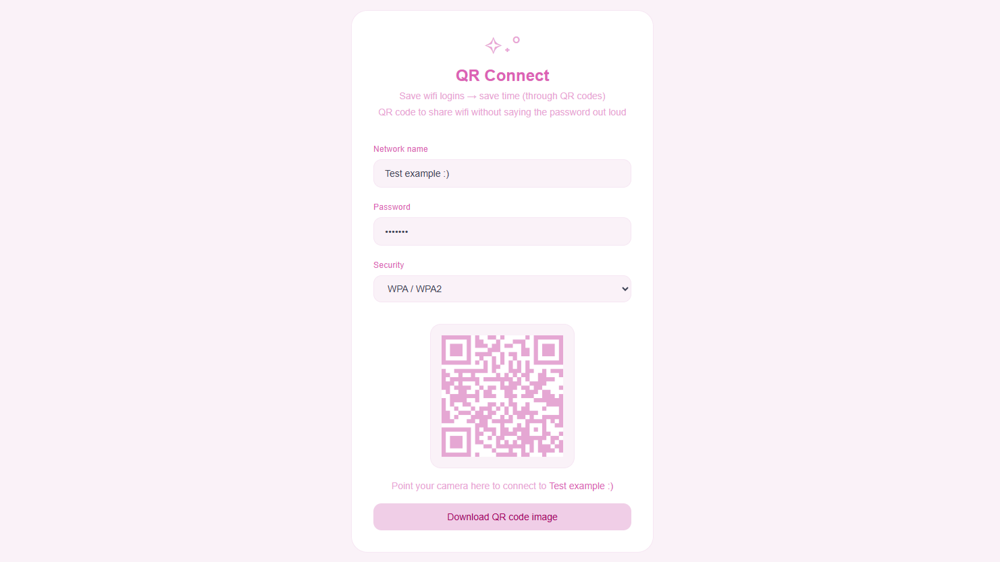

# QR Connect

    <strong>QR Connect</strong> is a web app to share QR codes for wifi without saying the password out loud.

    Save wifi logins → save time (through QR codes).

    

## Features
| **Overview** | **Details** |
|---|---|
| Network form | • Controlled inputs for network name (SSID), password, and security type (WPA/WPA2, WEP, open)  |
| QR generator | • Instantly generates a scannable wifi QR code as users type (no submit button needed) |
| Download | • Export the QR code as an image (.png) for sharing, printing, and more |

## Getting Started
| **Step** | **Instructions** |
|---|---|
| Git + GitHub Setup | • Ensure Git is installed ([download](https://git-scm.com/install/windows) based on OS) • Clone [this GitHub repository](https://github.com/allison-pham/qr-connect) using an IDE (e.g. Visual Studio Code) &nbsp;&nbsp;&nbsp;&nbsp;• Click "Code" (green button) > HTTPS > copy the link • Run `git clone "https://github.com/allison-pham/qr-connect"` |
| Installation | • Run `npm install` • Run `npm install qrcode.react` |
| Frontend | • Open up terminal: `npm run dev` • Open http://localhost:3000 |